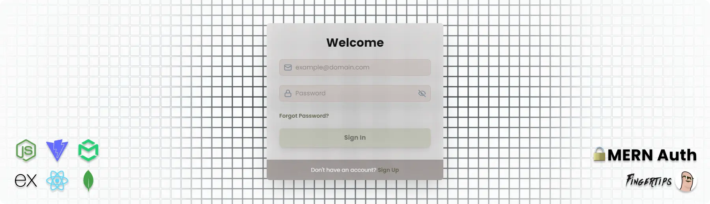

# 🔒 MERN-Auth

This repository features a **MERN** stack authentication system, encompassing user registration, login, and **JWT-based** session management. It securely handles passwords and token cookies, making it an excellent foundation for building secure and scalable web applications.

### 🔗 Website Link: [Live](https://mern-auth-tau7.onrender.com/)

## 📚 Table of Contents

- 🔧 [Technologies Used](#tech-used)
- ✨ [Features](#features)
- 📖 [Setup Instructions](#setup)
- 🐍 [Backend (Express JS)](#backend)
- ⚛️ [Frontend (React JS)](#frontend)
- 📡 [API Endpoints](#api)
- 🔒 [Authentication](#auth)
- 🤝 [Contributing](#contributing)
- 📜 [License](#license)

## 🔧 <a name="tech-used">Technologies Used</a>

- **Frontend**: React JS ⚛️
- **Backend**: Express JS 🐍
- **Database**: MongoDB 🗄️
- **Authentication**: JWT (JSON Web Tokens) 🔐
- **Email Service**: Mailtrap 📫

## ✨ <a name="features">Features</a>

- **🔒 User Authentication**: Comprehensive authentication system including sign-up, login, sign-out, and **JWT-based** session management.
- **✉️ Email Verification**: Integrated **Mailtrap** for managing email verification and password reset workflows.
- **🔑 Password Management**: Secure handling of forgot password, reset password, and reset verification workflows.
- **📝 CRUD Operations**: Create, Read, Update, and Delete operations for user and application data.
- **📱 Responsive UI**: Developed using **React** components, ensuring a seamless experience across devices.
- **📡 API**: Robust API constructed using **Express.js** and **MongoDB** for seamless data interaction.

## 📖 <a name="setup">Setup Instructions</a>

### 🛠️ <a name="backend">Backend (Express JS)</a>

1. **Clone the repository**:

   ```bash
   git clone https://github.com/Fingertips18/mern-auth.git
   ```

2. **Install dependencies**:

   ```bash
   npm install
   ```

3. **Set up environment variables. Create a `.env` file in the root directory:**:

   ```dotenv
   MONGO_URI=<MONGO_URI>
   PORT=<PORT>
   JWT_SECRET=<JWT_SECRET>
   NODE_ENV=<NODE_ENV>
   MAILTRAP_TOKEN=<MAILTRAP_TOKEN>
   MAILTRAP_TEMPLATE_ID=<MAILTRAP_TEMPLATE_ID>
   CLIENT_URL=<CLIENT_URL>
   ```

4. **Run the backend server**:
   ```bash
   npm run dev
   ```

### ⚛️ <a name="frontend">Frontend (React JS)</a>

1. **Navigate to the frontend directory**:

   ```bash
   cd frontend
   ```

2. **Install dependencies**:

   ```bash
   npm install
   ```

3. **Set up environment variables. Create a `.env.local` file in the frontend directory**:

   ```bash
   VITE_BASE_URL=<VITE_BASE_URL>
   ```

4. **Run the frontend server**:
   ```bash
   npm run dev
   ```

## 📡 <a name="api">API Endpoints</a>

- **Root**:

  - `GET /`: The root of the server

- **Authentication**:

  - `POST` **/api/auth/sign-up** : Register a new user.

  - `POST` **/api/auth/sign-in** : Log in a user and return a JWT.

  - `POST` **/api/auth/sign-out** : Log out a user and clear the session.

  - `POST` **/api/auth/verify-email** : Verify a user's email address.

  - `POST` **/api/auth/forgot-password** : Send a password reset email.

  - `POST` **/api/auth/reset-password** : Reset a user's password.

  - `GET` **/api/auth/verify-token** : Verify the validity of a JWT.

## 🔒 <a name="auth">Authentication</a>

This project uses JWT for secure authentication. Tokens are stored in cookies with `HttpOnly` and `SameSite` attributes for enhanced security.
Both the `frontend` and `backend` handle the verification and expiration of the token.

## 🤝 <a name="contributing">Contributing</a>

Feel free to fork this repository and contribute by submitting a pull request. All contributions are welcome!

#### 🧑‍💻 Contributors

<a href="https://github.com/Fingertips18/scroll-wheel-date-picker/graphs/contributors">
  
</a>

_Ghian Tan_ @ _Fingertips_ ([Github](https://github.com/Fingertips18))

## <a name="license">📜 License</a>

This project is licensed under the MIT License.
